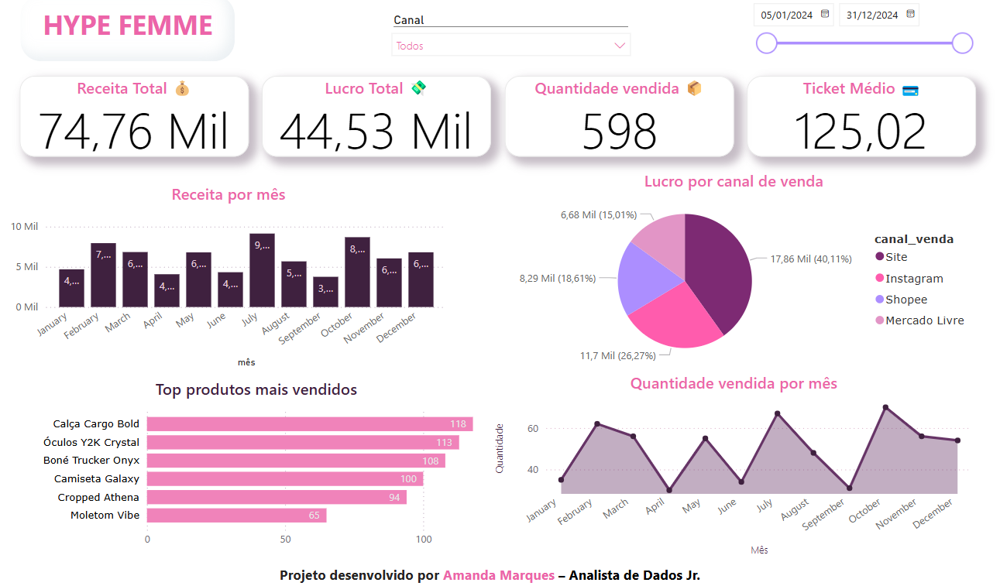

# hypefemme-analise-vendas
Projeto de análise de dados e visualização no Power BI da loja fictícia Hype Femme.
# 👚 Hype Femme – Análise de Vendas 2024

Análise de dados completa de uma loja fictícia de streetwear feminino, usando Python e Power BI para explorar o desempenho de vendas durante o ano de 2024.

---

## 📌 Objetivo

Este projeto tem como objetivo simular o dia a dia de um(a) analista de dados, aplicando técnicas de análise exploratória, visualização e geração de insights estratégicos com base nos KPIs de vendas de uma marca fictícia.

---

## 🧵 Sobre a marca

**Hype Femme** é uma marca de moda feminina streetwear com estética urbana, jovem e conectada às tendências. A loja atua no modelo D2C (direct-to-consumer), vendendo por site próprio, redes sociais e marketplaces como Shopee e Mercado Livre.

---

## 🧪 Ferramentas utilizadas

- Python (Jupyter Notebook)
- Pandas, Matplotlib, Seaborn
- Power BI
- Power Query
- Git & GitHub

---

## 🔍 Etapas do projeto

1. Criação de base de dados simulada
2. Análise exploratória (EDA)
3. Limpeza e tratamento dos dados
4. Visualizações com Python
5. Dashboard interativo no Power BI
6. Geração de insights e recomendações estratégicas

---

## 📊 Principais Análises

- Lucro por canal de venda
- Produtos mais vendidos
- Receita por mês
- Ticket médio
- Sazonalidade de compras

---

## 🧠 Insights e recomendações

- Canal com maior lucro: **Site próprio**
- Produto mais vendido: **Calça Cargo Bold**
- Ticket médio: **R$125,00**
- Picos de venda: **Fevereiro, Julho e Outubro**

🔎 *Ver mais detalhes no Jupyter Notebook e Dashboard.*

---

## 📂 Estrutura do repositório
